# Threadify Complete System Architecture

## Table of Contents
1. [System Overview](#system-overview)
2. [Master Architecture Diagram](#master-architecture-diagram)
3. [Entry Points Layer](#entry-points-layer)
4. [Service Layer](#service-layer)
5. [Repository Layer](#repository-layer)
6. [Storage Layer](#storage-layer)
7. [Data Flow Matrix](#data-flow-matrix)
8. [Complete Execution Flows](#complete-execution-flows)
9. [Authentication & Security](#authentication--security)
10. [Error Handling & Troubleshooting](#error-handling--troubleshooting)

## System Overview

Threadify is a multi-tenant, event-driven workflow engine with dual entry points (REST API and WebSocket) and a hybrid storage strategy using both Valkey (Redis-compatible) and PostgreSQL.

### Core Architectural Principles
- **Event-Driven**: Step processing through cryptographic event pipeline
- **Multi-Tenant**: Company-based data isolation
- **Hybrid Storage**: Valkey for fast access, PostgreSQL for persistence
- **Dual Entry Points**: REST for contracts, WebSocket for real-time workflows

## Master Architecture Diagram

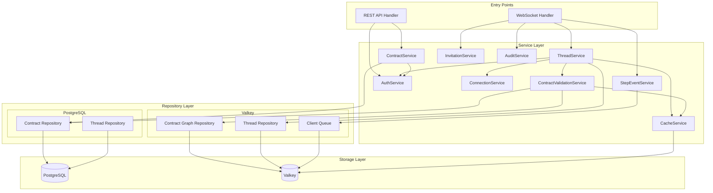

## Entry Points Layer

### REST API Handler (`internal/handlers/contracts.go`)

**Purpose**: Contract management and authentication for external systems

| Endpoint | Handler | Service | Authentication |
|----------|---------|---------|----------------|
| `POST /contracts/login` | `Login()` | AuthService | JWT-based |
| `GET /contracts` | `GetAllContracts()` | ContractService | JWT Bearer |
| `POST /contracts` | `CreateContract()` | ContractService | JWT Bearer |
| `GET /contracts/:id` | `GetContract()` | ContractService | JWT Bearer |
| `PUT /contracts/:id` | `UpdateContract()` | ContractService | JWT Bearer |
| `DELETE /contracts/:id` | `DeleteContract()` | ContractService | JWT Bearer |
| `GET /contracts/:id/versions` | `GetAllContractVersions()` | ContractService | JWT Bearer |
| `DELETE /contracts/:id/versions/:version` | `DeleteContractVersion()` | ContractService | JWT Bearer |

**Authentication Flow**:
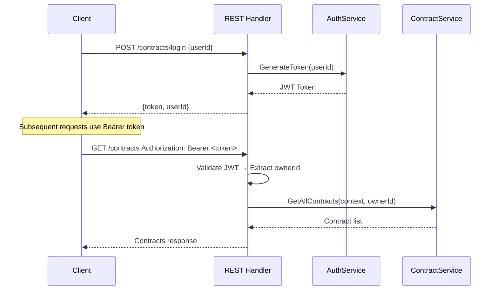

### WebSocket Handler (`internal/handlers/thread.go`)

**Purpose**: Real-time workflow execution and step processing

| Action | Handler | Service | Description |
|--------|---------|---------|-------------|
| `connect` | `HandleConnect()` | ThreadService | API key authentication |
| `startThread` | `HandleStartThread()` | ThreadService | Thread creation |
| `recordThreadEvent` | `HandleRecordEvent()` | ThreadService | Step event processing |
| `closeConnection` | `HandleClose()` | ThreadService | Connection cleanup |

## Service Layer

### ThreadService (`internal/service/thread.go`)

**Core Responsibilities**:
- WebSocket connection management
- Thread lifecycle (create, start, complete, fail)
- Event processing pipeline
- Contract validation integration

**Key Methods**:
```go
func (s *ThreadService) HandleConnect(req *models.ConnectRequest) *models.ConnectResponse
func (s *ThreadService) HandleStartThread(req *models.StartThreadRequest, ownerID, companyID string) *models.StartThreadResponse
func (s *ThreadService) HandleRecordEvent(req *models.RecordEventRequest, ownerID string) *models.RecordEventResponse
func (s *ThreadService) HandleClose(ownerID string) *models.CloseConnectionResponse
```

**Thread Creation Flow**:
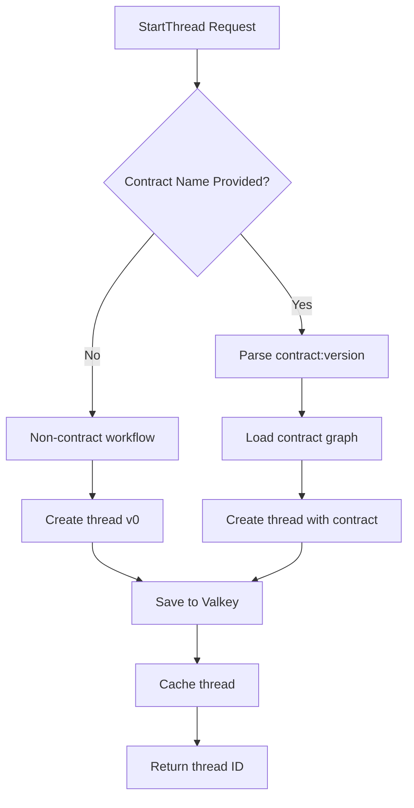

### ContractService (`internal/service/contract.go`)

**Core Responsibilities**:
- Contract CRUD operations
- Version management
- YAML parsing and validation
- Multi-tenancy enforcement

**Key Methods**:
```go
func (s *ContractService) CreateContract(ctx context.Context, ownerID, createdBy, contractYAML string) (int, interface{})
func (s *ContractService) GetContract(ctx context.Context, contractID, requesterID string, version *int) (int, interface{})
func (s *ContractService) UpdateContract(ctx context.Context, contractID, ownerID, createdBy, contractYAML string) (int, interface{})
func (s *ContractService) DeleteContract(ctx context.Context, contractID, ownerID string) (int, interface{})
```

**Contract Processing Pipeline**:
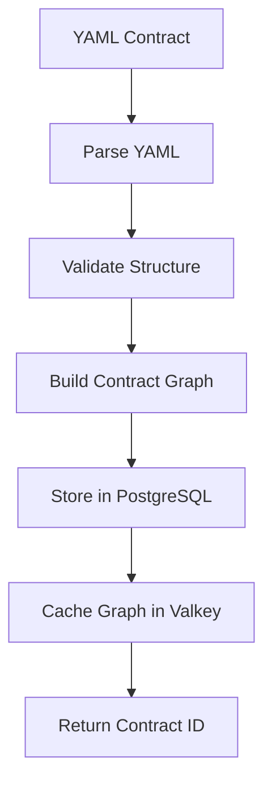

### StepEventService (`internal/service/step_event.go`)

**Core Responsibilities**:
- Event queue management (thread-specific sequential processing)
- Cryptographic processing pipeline (SHA-256 hashing)
- Event batching for performance
- Asynchronous processing with worker pool

**Key Features**:
- **Thread-specific queues**: Each thread gets its own queue for sequential event processing
- **Global batching**: Events batched globally (configurable batch size/timeout)
- **In-memory hash cache**: Last hash per thread cached in memory
- **Worker pool**: Configurable number of workers (default: 4)

**Processing Pipeline**:
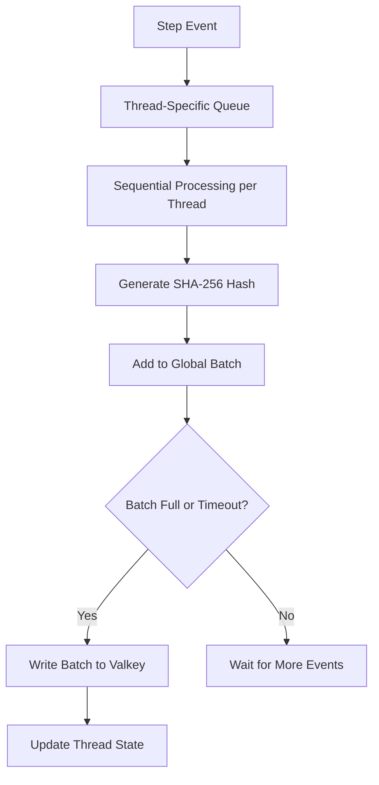

**Additional Services**:

### AuditEventService (`internal/service/audit.go`)

- Logs invitation token creation/usage
- Logs thread join events
- Stores events in Valkey queues with configurable retention
- Async processing (non-blocking)

### InvitationTokenService (`internal/service/invitation.go`)

- Creates JWT tokens for cross-org threading
- Validates tokens and extracts claims
- Role and permission validation
- Configurable expiry (24h default)

### CacheService (`internal/service/cache.go`)

- In-memory caching for threads and contract graphs
- Thread-safe with RWMutex
- First-tier cache before Valkey lookup

### ConnectionService (`internal/service/connection.go`)

- In-memory WebSocket connection tracking
- Company-based multi-tenancy support
- Session management (no Valkey storage)

### AuthService (`internal/service/auth.go`)

**Core Responsibilities**:
- JWT token generation and validation
- API key validation (WebSocket)
- User authentication and authorization

**Authentication Methods**:
```go
func (s *AuthService) GenerateToken(userID string) (string, error)
func (s *AuthService) ValidateToken(tokenString string) (*jwt.MapClaims, error)
func (s *AuthService) ValidateApiKey(apiKey string) (*UserInfo, error)
```

## Repository Layer

### PostgreSQL Repositories (`internal/repository/postgres/`)

#### Contract Repository (`contract.go`)
- **Purpose**: Persistent contract storage
- **Operations**: CRUD operations, versioning, soft deletes
- **Schema**: Contracts, contract_versions, users tables

#### Thread Repository (`thread.go`)
- **Purpose**: Thread metadata persistence
- **Operations**: Thread storage, retrieval, TTL management
- **Schema**: Threads, thread_events tables

### Valkey Repositories (`internal/repository/valkey/`)

#### Contract Graph Repository (`contract_graph.go`)
- **Purpose**: High-performance contract graph caching
- **Operations**: Graph storage, retrieval, TTL management
- **Data Structure**: JSON-serialized contract graphs

#### Thread Repository (`thread.go`)
- **Purpose**: Real-time thread state management
- **Operations**: Thread caching, state updates, session management
- **Data Structure**: Hash-based thread storage

#### Client Queue (`client_queue.go`)
- **Purpose**: Event queuing and processing
- **Operations**: Queue management, event streaming
- **Data Structure**: Redis streams or lists

## Storage Layer

### PostgreSQL

**Purpose**: Persistent, relational data storage
**Usage**:
- Contract definitions and versions
- Contract graphs (stored in contract_versions.graph)
- User and company information (future)

**Key Tables**:
```sql
contracts (id, owner_id, name, content_hash, latest_version, is_public, is_deleted, created_at, updated_at)
contract_versions (id, contract_id, version, content, content_hash, graph, created_by, is_deleted, created_at, updated_at)
```

**Note**: Thread storage in PostgreSQL exists in code but is **not used** in production. Threads are ephemeral (Valkey only).

### Valkey (Redis-compatible)

**Purpose**: High-performance caching and real-time data
**Usage**:
- Active thread states
- Contract graph caching
- Session management
- Event queuing
- Real-time counters and metrics

**Key Data Patterns**:
```redis
# Thread storage (ephemeral with TTL)
thread:{thread_id} → JSON thread object

# Contract graph caching (with TTL)
contract_graph:{contract_name}:{version} → JSON graph

# Step event batching
step_events:batch → List of hashed events (batched writes)

# Audit event queuing
queue:audit_events → List of audit events (with retention)

# Client connections (managed in-memory, not Valkey)
# Sessions managed by ConnectionService (in-memory)
```

## Data Flow Matrix

| Operation | Valkey | PostgreSQL | Both | Purpose |
|-----------|--------|------------|-------|---------|
| **Contract CRUD** | ❌ | ✅ | ❌ | Persistent contract storage |
| **Contract Graph Access** | ✅ | ✅ | ✅ | Valkey cache + PostgreSQL persistence |
| **Thread Creation** | ✅ | ❌ | ❌ | Real-time thread state (ephemeral) |
| **Thread Storage** | ✅ | ❌ | ❌ | Valkey only with TTL (no PostgreSQL) |
| **Step Events** | ✅ | ❌ | ❌ | In-memory queues + Valkey batching |
| **User Authentication** | ❌ | ❌ | ❌ | In-memory session management |
| **Audit Logging** | ✅ | ❌ | ❌ | Valkey queues with retention |
| **Contract Validation** | ✅ | ✅ | ✅ | Three-tier: In-memory → Valkey → PostgreSQL |
| **Connection Management** | ❌ | ❌ | ❌ | In-memory (ConnectionService) |

## Complete Execution Flows

### 1. Contract Creation Flow (REST)

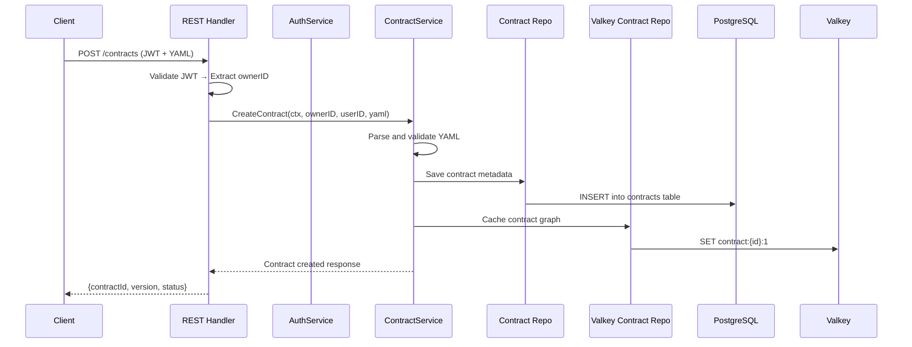

### 2. Thread Execution Flow (WebSocket)

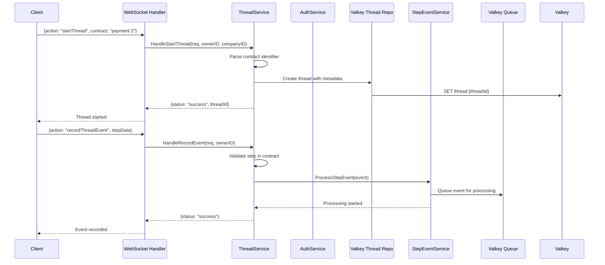

### 3. Event Processing Flow (Async)

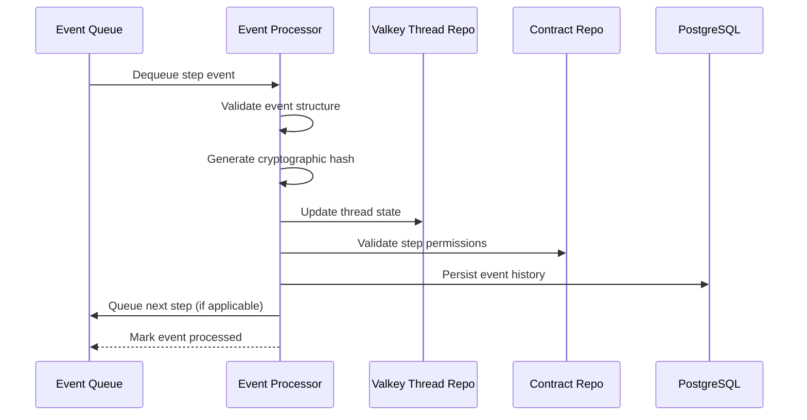

## Authentication & Security

### JWT Authentication (REST API)

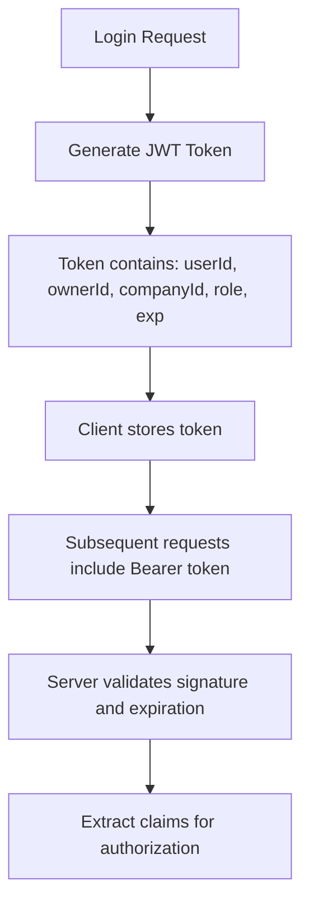

### API Key Authentication (WebSocket)

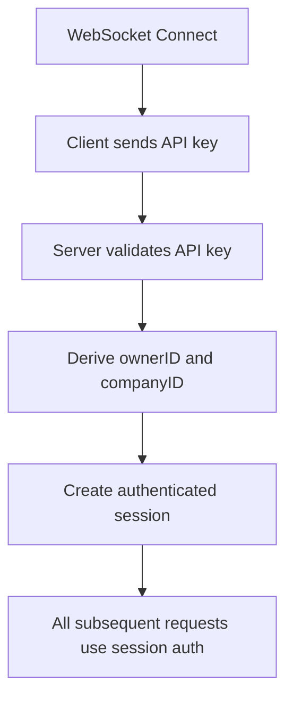

### Multi-Tenancy Enforcement

| Layer | Enforcement Mechanism |
|-------|----------------------|
| **REST Handler** | JWT claims contain companyID |
| **WebSocket Handler** | Session stores companyID |
| **Service Layer** | All queries filtered by companyID |
| **Repository Layer** | Company-based data isolation |
| **Storage Layer** | Separate keyspaces and tables |

## Error Handling & Troubleshooting

### Error Classification by Layer

| Layer | Common Errors | Troubleshooting |
|-------|---------------|----------------|
| **Entry Points** | Invalid JWT, malformed requests | Check token format, request body |
| **Service Layer** | Validation failures, permission denied | Verify user permissions, data format |
| **Repository Layer** | Connection failures, timeouts | Check database connectivity, query performance |
| **Storage Layer** | Disk full, memory issues | Monitor storage, memory usage |

### Common Issues and Solutions

#### "Step is still running" Issue
**Symptoms**: Step events not processing, threads stuck
**Root Causes**:
1. Event queue backup
2. StepEventService not running
3. Valkey connection issues

**Troubleshooting**:
```bash
# Check event queue depth
> LLEN step_events:queue

# Check StepEventService status
> ps aux | grep step_event_service

# Check Valkey connectivity
> redis-cli ping
```

#### Connection Timeouts
**Symptoms**: WebSocket connections dropping
**Root Causes**:
1. Network issues
2. Session cleanup problems
3. Memory pressure

**Troubleshooting**:
```bash
# Check active sessions
> HGETALL sessions:*

# Check WebSocket handler logs
> tail -f logs/websocket.log

# Monitor memory usage
> top | grep threadify
```

#### Contract Validation Failures
**Symptoms**: Contract creation/update failures
**Root Causes**:
1. Invalid YAML syntax
2. Circular dependencies
3. Missing required fields

**Troubleshooting**:
```bash
# Validate YAML locally
> yamllint contract.yaml

# Check contract graph structure
> redis-cli GET contract:{id}:{version}

# Review validation logs
> grep -i validation logs/contract.log
```

### Monitoring and Observability

#### Key Metrics to Monitor
- **WebSocket Connections**: Active sessions, connection rate
- **Thread Processing**: Creation rate, completion rate, error rate
- **Event Processing**: Queue depth, processing latency
- **Storage Performance**: Valkey memory usage, PostgreSQL query times
- **Authentication**: Token validation rate, API key validation failures

#### Log Patterns
```bash
# Authentication failures
grep "Invalid.*token\|Invalid.*api" logs/auth.log

# Thread lifecycle events
grep "thread.*started\|thread.*completed" logs/thread.log

# Event processing metrics
grep "event.*queued\|event.*processed" logs/event.log

# Storage performance
grep "slow.*query\|connection.*timeout" logs/storage.log
```

## Configuration Management

### Environment Variables
```bash
# Database Configuration
POSTGRES_HOST=localhost
POSTGRES_PORT=5432
POSTGRES_DB=threadify
POSTGRES_USER=threadify
POSTGRES_PASSWORD=password

# Valkey Configuration  
VALKEY_HOST=localhost
VALKEY_PORT=6379
VALKEY_DB=0

# Authentication
JWT_SECRET=your-secret-key
JWT_EXPIRATION=24h

# Service Configuration
WEBSOCKET_PORT=8080
REST_PORT=8081
CONTRACT_TTL=3600
THREAD_TTL=7200
```

### Service Dependencies
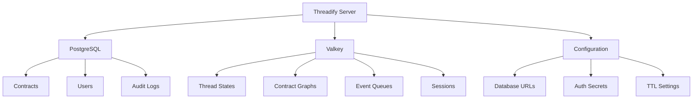

---

*This documentation covers the complete Threadify system architecture as of v2.0, including the dual entry points (REST/WebSocket), hybrid storage strategy, and event-driven processing pipeline.*
