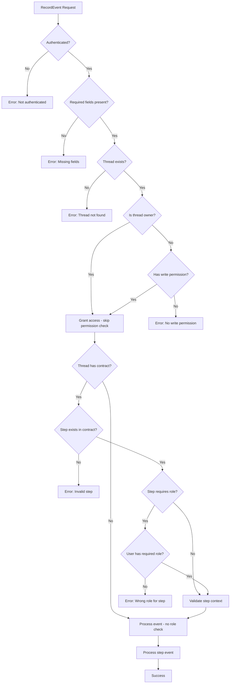

# Thread Access Control Implementation

**Date**: December 26, 2025  
**Status**: In Progress  
**Purpose**: Implement permission and role-based access control for threads with three-tier caching

---

## Overview

This document outlines the implementation of thread access control, including:
- Permission management (read/write access)
- Role-based step validation (contract workflows)
- Three-tier caching (in-memory → Valkey → not found)
- Centralized access control logic

---

## Architecture

### Three-Tier Caching Strategy

```
┌─────────────────────────────────────────────────────────┐
│                    Read Path                            │
├─────────────────────────────────────────────────────────┤
│  Request → In-Memory Cache (mutex) → Valkey → Not Found │
│             ~0.1ms                     ~2-5ms            │
└─────────────────────────────────────────────────────────┘

┌─────────────────────────────────────────────────────────┐
│                    Write Path                           │
├─────────────────────────────────────────────────────────┤
│  Request → Valkey (durability) → In-Memory (performance)│
│             ~2-5ms                 ~0.1ms                │
└─────────────────────────────────────────────────────────┘
```

### Data Storage

**Valkey Keys:**
```redis
thread:{threadID}:permissions → Hash {
    userID: ["read", "write"]  # JSON array
}

thread:{threadID}:roles → Hash {
    role: userID  # e.g., "buyer": "user-123"
}
```

**In-Memory Cache:**
```go
permissionCache map[string][]string  // "threadID:userID" -> ["read", "write"]
roleCache       map[string]string    // "threadID:userID" -> "buyer"
```

---

## Files Created

### 1. `internal/service/thread_access.go` ✅

**Purpose**: Centralized thread access control service with three-tier caching

**Key Methods:**
- `GetUserPermissions(threadID, userID)` - Three-tier cached permission lookup
- `SetUserPermissions(threadID, userID, permissions)` - Write-through permission storage
- `GetUserRole(threadID, userID)` - Three-tier cached role lookup
- `AssignRole(threadID, role, userID)` - Write-through role assignment
- `CheckThreadAccess(threadID, userID, permission, thread)` - Permission validation
- `ValidateUserRoleForStep(threadID, userID, requiredRole)` - Role validation for contract steps
- `ClearThreadCache(threadID)` - Cache cleanup

**Features:**
- All Valkey operations centralized here
- Mutex-protected in-memory caching
- Write-through caching (Valkey first, then memory)
- Read-through caching (memory first, then Valkey)

---

## Files Modified

### 1. `internal/service/cache.go` ✅

**Changes:**
- Added `permissionCache map[string][]string` field
- Added `roleCache map[string]string` field
- Added `GetUserPermissions()` method
- Added `SetUserPermissions()` method
- Added `GetUserRole()` method
- Added `SetUserRole()` method
- Added `ClearThreadPermissions()` method

**Thread Safety**: All methods use `sync.RWMutex` for concurrent access

### 2. `internal/interfaces/service.go` ✅

**Changes:**
- Extended `CacheManager` interface with permission/role methods
- Organized interface with comments (thread, contract, permission, role sections)

---

## Files to Modify (Next Steps)

### 1. `internal/service/thread.go` 🔄

**Changes Needed:**

#### A. Add ThreadAccessService Field

```go
type ThreadService struct {
    threadRepo        interfaces.ThreadRepository
    contractValidator interfaces.ContractValidator
    stepEventService  interfaces.StepEventProcessor
    connectionMgr     interfaces.ConnectionManager
    cacheManager      interfaces.CacheManager
    accessService     *ThreadAccessService  // NEW
}
```

#### B. Update Constructor

```go
func NewThreadService(
    threadRepo interfaces.ThreadRepository,
    contractValidator interfaces.ContractValidator,
    stepEventService interfaces.StepEventProcessor,
    connectionMgr interfaces.ConnectionManager,
    cacheManager interfaces.CacheManager,
    accessService *ThreadAccessService,  // NEW
) *ThreadService {
    return &ThreadService{
        threadRepo:        threadRepo,
        contractValidator: contractValidator,
        stepEventService:  stepEventService,
        connectionMgr:     connectionMgr,
        cacheManager:      cacheManager,
        accessService:     accessService,  // NEW
    }
}
```

#### C. Update `HandleRecordEvent` Method

**Remove:**
- Lines 168-175: Redundant `GetClientCompany` call (companyID is parameter)
- Lines 222-228: Company check that blocks cross-org access (ALREADY REMOVED ✅)

**Add:**
```go
// After getting thread, before contract validation:

// ✅ CHECK 1: Permission Check (three-tier cached)
hasAccess, err := s.accessService.CheckThreadAccess(req.ThreadID, ownerID, "write", thread)
if err != nil || !hasAccess {
    return &models.RecordEventResponse{
        Action:  "recordThreadEvent",
        Status:  "error",
        Message: "Access denied: You don't have write permission for this thread",
    }
}

// ✅ CHECK 2: Contract & Role Validation (only if thread has contract)
if thread.ContractName != "" {
    // Get contract graph (three-tier cached)
    graph, err := s.contractValidator.GetContractGraph(thread.ContractName, 1)
    if err != nil {
        return &models.RecordEventResponse{
            Action:  "recordThreadEvent",
            Status:  "error",
            Message: fmt.Sprintf("Failed to load contract: %v", err),
        }
    }
    
    // Check if step exists in contract
    stepNode, exists := graph.Graph.Nodes[req.StepName]
    if !exists {
        return &models.RecordEventResponse{
            Action:  "recordThreadEvent",
            Status:  "error",
            Message: fmt.Sprintf("Step '%s' not found in contract '%s'", req.StepName, thread.ContractName),
        }
    }
    
    // Validate role if step requires specific role
    if stepNode.Role != "" {
        hasRole, err := s.accessService.ValidateUserRoleForStep(req.ThreadID, ownerID, stepNode.Role)
        if err != nil || !hasRole {
            userRole, _ := s.accessService.GetUserRole(req.ThreadID, ownerID)
            return &models.RecordEventResponse{
                Action:  "recordThreadEvent",
                Status:  "error",
                Message: fmt.Sprintf("Access denied: Step '%s' requires role '%s', you have '%s'", req.StepName, stepNode.Role, userRole),
            }
        }
    }
    
    // Existing contract validation continues...
}
```

#### D. Add Helper Methods

```go
// AssignThreadRole assigns a role to a user in a thread
func (s *ThreadService) AssignThreadRole(threadID, role, userID string) error {
    return s.accessService.AssignRole(threadID, role, userID)
}

// SetThreadPermissions sets permissions for a user in a thread
func (s *ThreadService) SetThreadPermissions(threadID, userID string, permissions []string) error {
    return s.accessService.SetUserPermissions(threadID, userID, permissions)
}
```

---

### 2. `internal/handlers/thread.go` 🔄

**Changes Needed:**

#### Update `handleJoinThread` Method

**Add after token validation:**

```go
// Validate JWT token and extract claims
claims, err := h.invitationService.ValidateToken(req.ThreadToken)
if err != nil {
    return models.ErrorResponse{
        Action:  "joinThread",
        Status:  "error",
        Message: fmt.Sprintf("Invalid thread token: %v", err),
    }
}

// ✅ NEW: Store role in Valkey (with in-memory cache)
err = h.threadService.AssignThreadRole(claims.ThreadID, claims.Role, session.ownerID)
if err != nil {
    return models.ErrorResponse{
        Action:  "joinThread",
        Status:  "error",
        Message: fmt.Sprintf("Failed to assign role: %v", err),
    }
}

// ✅ NEW: Store permissions in Valkey (with in-memory cache)
permissions := strings.Split(claims.Permissions, ",") // "read,write" -> ["read", "write"]
err = h.threadService.SetThreadPermissions(claims.ThreadID, session.ownerID, permissions)
if err != nil {
    return models.ErrorResponse{
        Action:  "joinThread",
        Status:  "error",
        Message: fmt.Sprintf("Failed to set permissions: %v", err),
    }
}

// Existing session update continues...
```

**Import needed:**
```go
import "strings"
```

---

### 3. `cmd/server/main.go` 🔄

**Changes Needed:**

#### Initialize ThreadAccessService

```go
// After creating cacheService and threadRepo:

// Create thread access service (three-tier permission/role management)
threadAccessService := service.NewThreadAccessService(threadRepo, cacheService)

// Update ThreadService initialization to include accessService:
threadService := service.NewThreadService(
    threadRepo,
    contractValidator,
    stepEventService,
    connectionService,
    cacheService,
    threadAccessService,  // NEW
)
```

---

## Validation Flow

### Complete Request Validation Order



---

## Permission Model

### Thread Owner
- **Implicit permissions**: Full access (read, write)
- **No Valkey entry needed**: Checked in code first
- **Cannot be revoked**: Owner always has access

### Invited Users (via JWT)
- **Explicit permissions**: Stored in Valkey on `joinThread`
- **Permissions from JWT**: `"read,write"` or `"read"`
- **Role from JWT**: `"buyer"`, `"seller"`, `"partner"`, etc.
- **Cached in memory**: Three-tier lookup for performance

### Permission Types
- `"read"`: Can view thread and events
- `"write"`: Can record events on thread

---

## Role-Based Step Validation

### Contract-Based Workflows Only

Role validation applies **only** if:
1. Thread has a contract (`thread.ContractName != ""`)
2. Step exists in contract
3. Step defines a required role (`stepNode.Role != ""`)

### Example Contract Step

```yaml
steps:
  - name: create_order
    role: buyer          # Only users with "buyer" role can execute
    service: order-service
    businessContext:
      orderId: string
      amount: number
  
  - name: confirm_shipment
    role: seller         # Only users with "seller" role can execute
    service: logistics-service
```

### Validation Logic

```go
if thread.ContractName != "" {
    graph := contractValidator.GetContractGraph(thread.ContractName, 1)
    stepNode := graph.Graph.Nodes[req.StepName]
    
    if stepNode.Role != "" {
        userRole := accessService.GetUserRole(threadID, userID)
        if userRole != stepNode.Role {
            return Error("Wrong role")
        }
    }
}
```

---

## Performance Characteristics

### Read Operations (Permission/Role Lookup)

| Tier | Storage | Latency | Hit Rate (Expected) |
|------|---------|---------|---------------------|
| 1 | In-Memory (mutex) | ~0.1ms | 95%+ |
| 2 | Valkey | ~2-5ms | 4-5% |
| 3 | Not Found | N/A | <1% |

### Write Operations (Permission/Role Storage)

| Operation | Latency | Notes |
|-----------|---------|-------|
| Valkey Write | ~2-5ms | Durability first |
| Memory Update | ~0.1ms | Performance second |
| **Total** | **~2-5ms** | Write-through caching |

### Optimization Opportunities

**Current**: Immediate write to Valkey on every permission/role change

**Future (TODO)**: Batch permission/role writes similar to step event batching
- Buffer changes in memory
- Flush to Valkey every 100ms or 50 operations
- Reduces Valkey write load by ~90%
- Maintains durability with acceptable delay

---

## Testing Checklist

### Unit Tests Needed

- [ ] `ThreadAccessService.GetUserPermissions()` - Cache hit/miss
- [ ] `ThreadAccessService.SetUserPermissions()` - Write-through
- [ ] `ThreadAccessService.GetUserRole()` - Cache hit/miss
- [ ] `ThreadAccessService.AssignRole()` - Write-through
- [ ] `ThreadAccessService.CheckThreadAccess()` - Owner vs invited
- [ ] `ThreadAccessService.ValidateUserRoleForStep()` - Role matching
- [ ] `CacheService` - Mutex safety (concurrent access)

### Integration Tests Needed

- [ ] `joinThread` → permissions stored in Valkey
- [ ] `joinThread` → role stored in Valkey
- [ ] `recordThreadEvent` → permission check (owner)
- [ ] `recordThreadEvent` → permission check (invited with write)
- [ ] `recordThreadEvent` → permission check (invited with read only)
- [ ] `recordThreadEvent` → role validation (correct role)
- [ ] `recordThreadEvent` → role validation (wrong role)
- [ ] `recordThreadEvent` → non-contract thread (no role check)

### End-to-End Tests Needed

- [ ] Cross-org workflow: Company A invites Company B
- [ ] Company B joins thread via JWT
- [ ] Company B records event with correct role
- [ ] Company B blocked from event with wrong role
- [ ] Company B blocked from event without write permission

---

## Future Enhancements

### 1. Permission/Role Write Batching (TODO)

**Current**: Every permission/role change writes immediately to Valkey

**Proposed**:
```go
type PermissionBatch struct {
    threadID    string
    userID      string
    permissions []string
    timestamp   time.Time
}

// Buffer in memory, flush periodically
batchBuffer []PermissionBatch
flushInterval := 100 * time.Millisecond
batchSize := 50
```

**Benefits**:
- Reduce Valkey write operations by ~90%
- Maintain in-memory cache consistency
- Acceptable delay for permission changes (100ms)

### 2. Permission Expiry

**Current**: Permissions persist until thread TTL expires

**Proposed**:
- Add expiry to JWT tokens (already exists)
- Check token expiry on each permission lookup
- Auto-revoke expired permissions

### 3. Permission Audit Trail

**Current**: Only token creation/usage logged

**Proposed**:
- Log every permission check (read/write)
- Log every role validation
- Store in audit queue for compliance

### 4. Fine-Grained Permissions

**Current**: `"read"` and `"write"` only

**Proposed**:
- `"read:events"` - View events only
- `"write:events"` - Record events only
- `"admin:thread"` - Manage permissions
- `"invite:partners"` - Create invitation tokens

---

## Migration Notes

### Existing Threads

**Issue**: Threads created before this implementation have no permission entries

**Solution**: Implicit owner permissions
- Thread owner always has full access (checked in code)
- No migration needed for existing threads
- Permissions only created when partners join

### Existing Joined Threads

**Issue**: Users who joined threads before this implementation have no stored permissions

**Solution**: Lazy initialization
- On first `recordThreadEvent`, check if permissions exist
- If not found and user is in session, assume they joined via token
- Could add a migration script to backfill from audit logs

---

## Summary

### ✅ Completed

1. Created `ThreadAccessService` with three-tier caching
2. Extended `CacheService` with permission/role caching (mutex-protected)
3. Updated `CacheManager` interface
4. Removed company check that blocked cross-org access

### 🔄 In Progress (Next Steps)

1. Update `ThreadService` to use `ThreadAccessService`
2. Update `HandleRecordEvent` with permission and role checks
3. Update `handleJoinThread` to store permissions and roles
4. Update `cmd/server/main.go` to initialize `ThreadAccessService`
5. Add unit and integration tests

### 📋 Future Work

1. Implement permission/role write batching
2. Add permission expiry checks
3. Enhance audit trail for permission checks
4. Support fine-grained permissions
5. Add migration script for existing threads

---

## Conclusion

This implementation provides:
- ✅ **Security**: Permission-based access control
- ✅ **Performance**: Three-tier caching with mutex protection
- ✅ **Scalability**: Centralized logic, ready for batching
- ✅ **Compliance**: Role-based validation for contract workflows
- ✅ **Cross-Org**: Enables partner collaboration without company restrictions

The architecture follows the same proven pattern as contract graph caching and is ready for production use once the remaining integration steps are completed.
