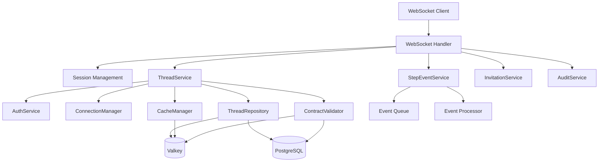
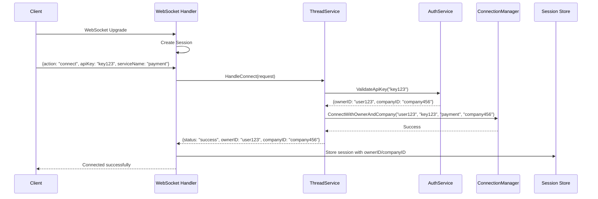
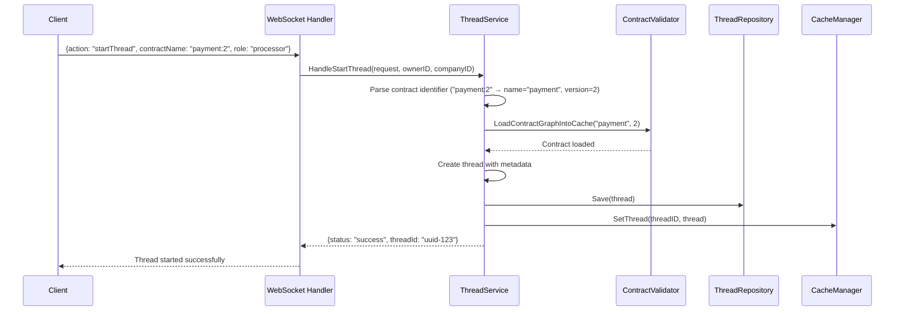
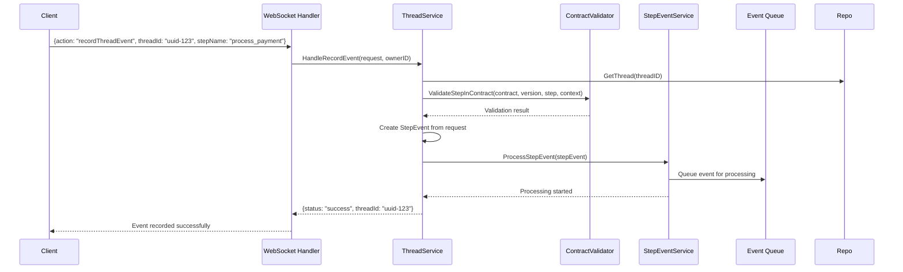
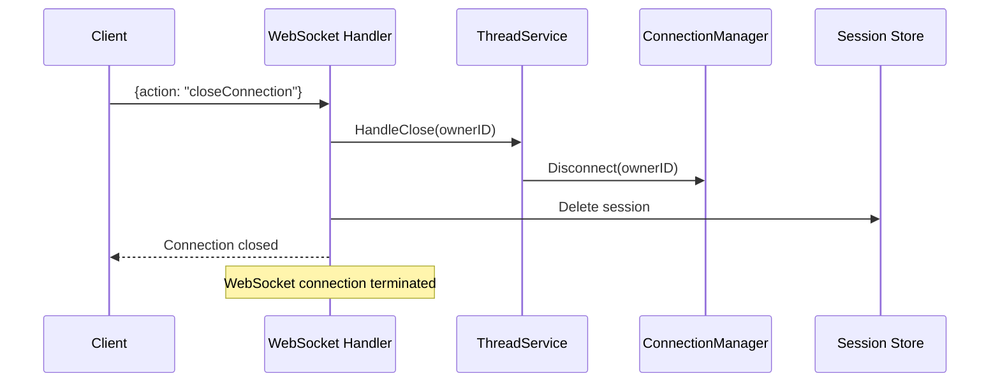
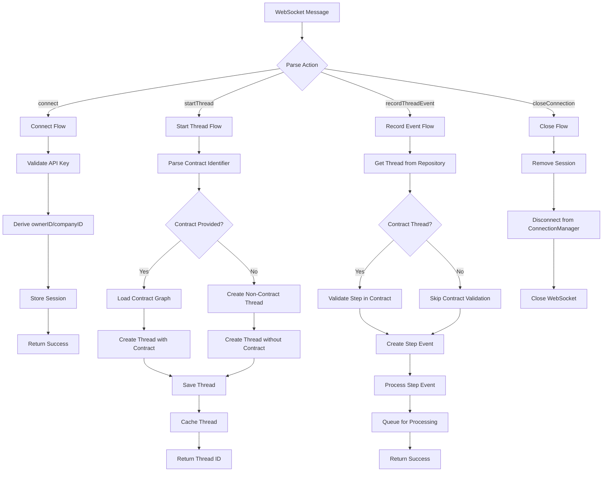
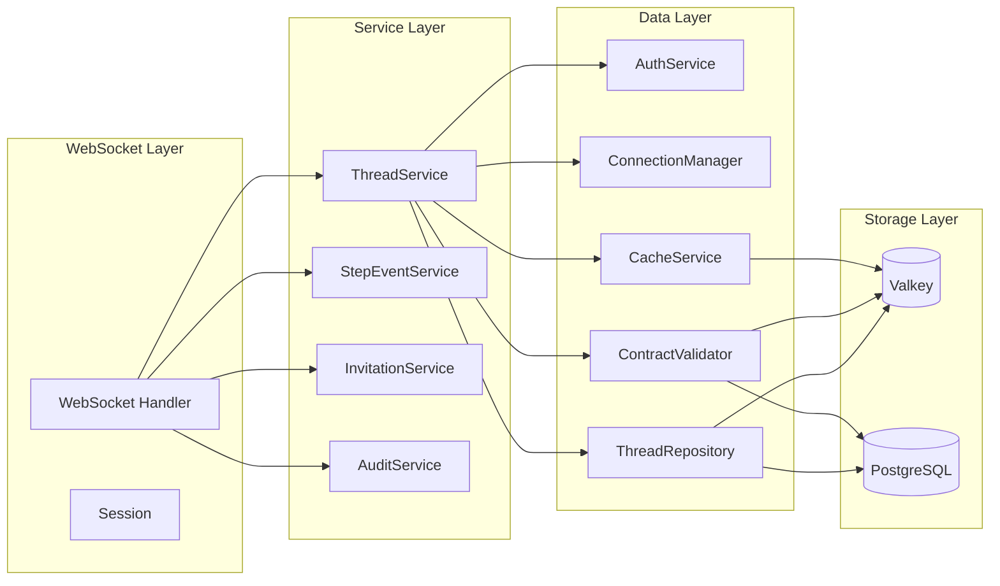
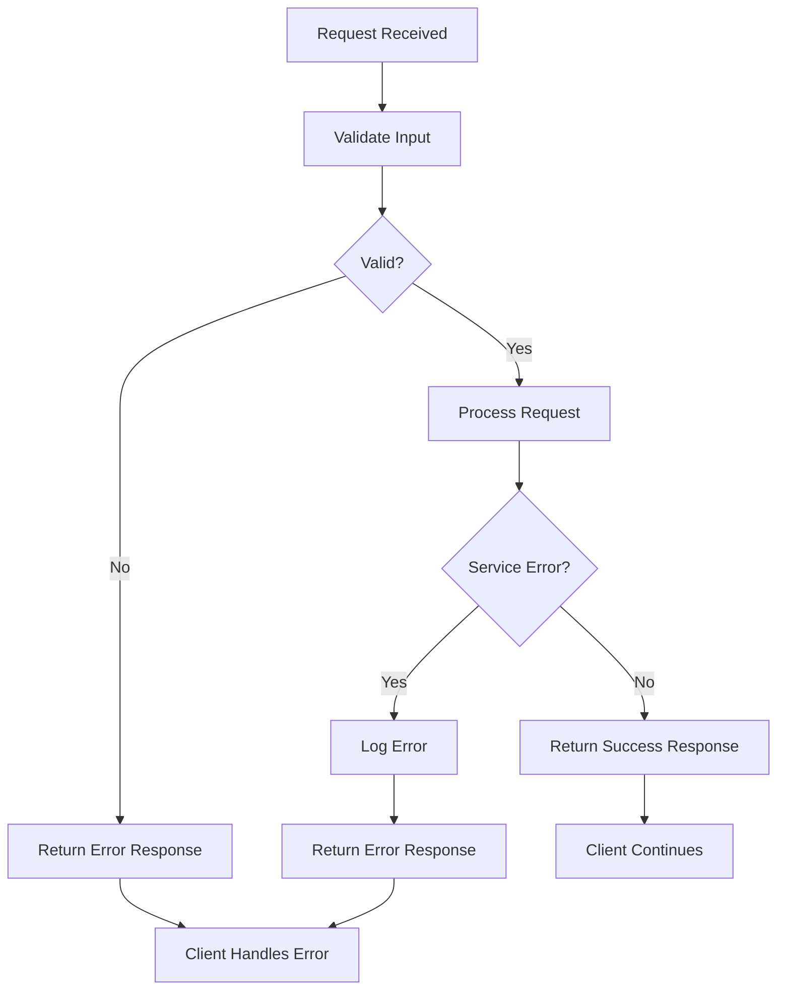

# Threadify WebSocket Server Architecture

## Table of Contents
1. [Architecture Overview](#architecture-overview)
2. [Component Responsibilities](#component-responsibilities)
3. [Message Flows](#message-flows)
   - [Connect Flow](#connect-flow)
   - [Start Thread Flow](#start-thread-flow)
   - [Record Event Flow](#record-event-flow)
   - [Close Connection Flow](#close-connection-flow)
4. [Data Models](#data-models)
5. [Execution Graph](#execution-graph)

## Architecture Overview



### Key Architectural Changes

**Recent Refactoring (v2.0):**
- ✅ **Server-driven authentication**: API key → ownerID/companyID derivation
- ✅ **Event-driven architecture**: Removed Context/Steps from Thread model
- ✅ **Non-contract workflows**: Support for threads without contracts
- ✅ **Contract version parsing**: `contract_name:version` format support

## Component Responsibilities

### WebSocket Handler (`internal/handlers/thread.go`)

| Component | Responsibility | Key Methods |
|-----------|----------------|-------------|
| **WebSocketHandler** | WebSocket connection management, message routing, session lifecycle | `HandleWebSocket()`, `handleMessage()` |
| **Session** | Per-connection state (ownerID, companyID, threadIDs) | N/A (struct) |

**Key Features:**
- WebSocket upgrade with configurable timeouts
- Session-based authentication state management
- Message routing to appropriate services
- Automatic cleanup on disconnection

### ThreadService (`internal/service/thread.go`)

| Responsibility | Description |
|----------------|-------------|
| **Connection Management** | Handles API key validation, user authentication, company assignment |
| **Thread Lifecycle** | Creates threads (contract/non-contract), manages thread metadata |
| **Event Processing** | Validates step events, processes through event pipeline |
| **Contract Validation** | Validates steps against contract definitions |

**Key Methods:**
- `HandleConnect()` - API key authentication
- `HandleStartThread()` - Thread creation (contract/non-contract)
- `HandleRecordEvent()` - Step event processing
- `HandleClose()` - Connection cleanup

### StepEventService (`internal/service/step_event.go`)

| Responsibility | Description |
|----------------|-------------|
| **Event Processing** | Processes step events through cryptographic pipeline |
| **Queue Management** | Manages event queue and processing workflow |
| **Service Lifecycle** | Starts/stops event processing service |

## Message Flows

### Connect Flow



**Request:**
```json
{
  "action": "connect",
  "apiKey": "api-key-123",
  "serviceName": "payment-service"
}
```

**Response:**
```json
{
  "action": "connect",
  "status": "success",
  "message": "Connected successfully",
  "ownerId": "user-123",
  "companyId": "company-abc"
}
```

### Start Thread Flow



**Non-Contract Workflow:**
```json
{
  "action": "startThread",
  "refs": {"serviceName": "billing-service"}
}
```

**Contract Workflow:**
```json
{
  "action": "startThread",
  "contractName": "payment-flow:2",
  "role": "payment_processor",
  "refs": {"serviceName": "payment-service"}
}
```

### Record Event Flow



**Request:**
```json
{
  "action": "recordThreadEvent",
  "threadId": "thread-uuid-123",
  "stepName": "data_processing",
  "type": "step_completed",
  "status": "success",
  "context": {"result": "processed", "count": 42},
  "startedAt": "2024-01-01T10:00:00Z",
  "finishedAt": "2024-01-01T10:05:00Z"
}
```

### Close Connection Flow



## Data Models

### WebSocket Messages

#### ConnectRequest
```go
type ConnectRequest struct {
    Action       string   `json:"action"`
    ApiKey       string   `json:"apiKey"`
    ServiceName  string   `json:"serviceName,omitempty"`
    SubscribedEvents []string `json:"subscribedEvents,omitempty"`
}
```

#### StartThreadRequest
```go
type StartThreadRequest struct {
    Action       string            `json:"action"`
    ContractName string            `json:"contractName"` // Format: "name" or "name:version"
    Role         string            `json:"role,omitempty"`
    Refs         map[string]string `json:"refs,omitempty"`
}
```

#### RecordEventRequest
```go
type RecordEventRequest struct {
    Action      string            `json:"action"`
    ThreadID    string            `json:"threadId"`
    StepName    string            `json:"stepName"`
    Type        string            `json:"type"`
    StartedAt   string            `json:"startedAt"`
    FinishedAt  string            `json:"finishedAt"`
    Context     map[string]string `json:"context"`
    Refs        map[string]string `json:"refs,omitempty"`
    Status      string            `json:"status"`
    ServiceName string            `json:"serviceName,omitempty"`
}
```

### Thread Model (v2.0 - Event-Driven)

```go
type Thread struct {
    ID              string                 `json:"id"`
    ContractID      *string                `json:"contractId,omitempty"`
    ContractVersion *int                   `json:"contractVersion,omitempty"`
    ContractName    string                 `json:"contractName,omitempty"`
    Refs            map[string]string      `json:"refs,omitempty"`
    OwnerID         string                 `json:"ownerId"`
    CompanyID       string                 `json:"companyId"`
    Status          ThreadStatus           `json:"status"`
    CurrentStep     string                 `json:"currentStep"`
    LastHash        string                 `json:"lastHash"`
    StartedAt       time.Time              `json:"startedAt"`
    CompletedAt     *time.Time             `json:"completedAt,omitempty"`
    Error           string                 `json:"error,omitempty"`
}
```

**Key Changes in v2.0:**
- ❌ **Removed:** `Context` field (now in events)
- ❌ **Removed:** `Steps` field (now in events)
- ✅ **Added:** `Refs` field for external references
- ✅ **Enhanced:** Company-based multi-tenancy

### Step Event Model

```go
type StepEvent struct {
    StepID      string                 `json:"step_id"`
    Type        string                 `json:"type"` // step_started, step_completed, step_failed
    Context     map[string]interface{} `json:"context"`
    Status      string                 `json:"status"` // success, failure
    Timestamp   time.Time              `json:"timestamp"`
    ServiceName string                 `json:"service_name"`
    ThreadID    string                 `json:"thread_id"`
    StepName    string                 `json:"step_name"`
    StartedAt   string                 `json:"started_at"`
    FinishedAt  string                 `json:"finished_at"`
}
```

## Execution Graph

### Complete Request Processing Flow



### Service Dependencies



### Error Handling Flow



## Performance Considerations

### Connection Management
- **Session Storage**: In-memory `sync.Map` for fast lookup
- **Connection Limits**: Configurable via ConnectionManager
- **Timeout Handling**: WebSocket handshake timeout (10s default)

### Data Storage Strategy
- **Thread Metadata**: Valkey for fast access with TTL
- **Contract Graphs**: Three-tier caching (Valkey → In-memory → PostgreSQL)
- **Event Processing**: Queue-based for high throughput

### Scalability Features
- **Multi-tenancy**: Company-based isolation
- **Event-driven**: Reduced thread model size
- **Async Processing**: Step events processed separately

## Security Architecture

### Authentication Flow
1. **API Key Validation**: Mock service maps keys to user/company
2. **Session Management**: OwnerID/companyID stored in session
3. **Request Authorization**: Session-based for all subsequent requests

### Data Isolation
- **Company-based**: All data filtered by companyID
- **User Threads**: Users can only access their own threads
- **Contract Access**: Validated against company permissions

## Configuration

### WebSocket Configuration
```go
var upgrader = websocket.Upgrader{
    CheckOrigin:      func(r *http.Request) bool { return true },
    HandshakeTimeout: 10 * time.Second,
    ReadBufferSize:   1024,
    WriteBufferSize:  1024,
}
```

### Service Configuration
- **Contract TTL**: Configurable cache duration
- **Thread TTL**: Configurable thread persistence
- **Auth Secret**: JWT secret for token generation

---

*This documentation covers the complete WebSocket server architecture as of v2.0, including the recent refactoring to event-driven processing and server-driven authentication.*
