# WebSocket Handler Execution Flow

**Last Updated**: December 26, 2025  
**Purpose**: Complete execution flow documentation for WebSocket message handling

---

## High-Level Architecture

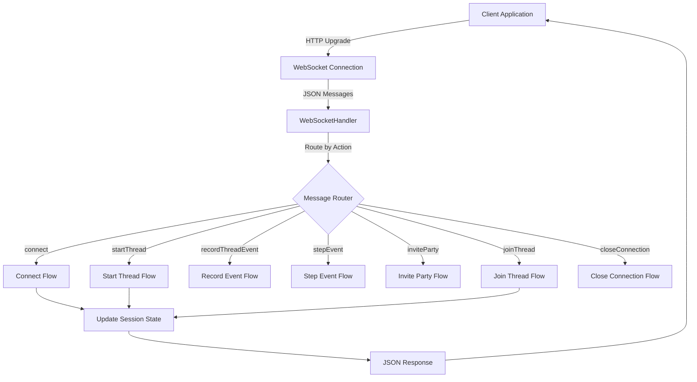

---

## 1. Connection Establishment Flow

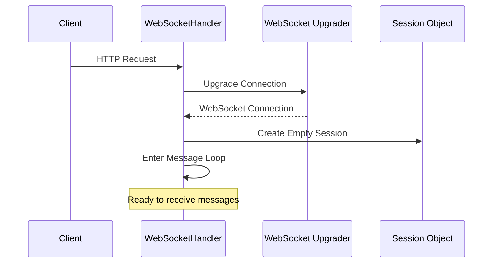

**Key Points:**

- HTTP → WebSocket upgrade via gorilla/websocket
- Empty session created (no ownerID yet)
- Infinite loop: Read → Process → Write → Repeat
- Connection stays open until error or close action

---

## 2. Connect Action Flow (Authentication)

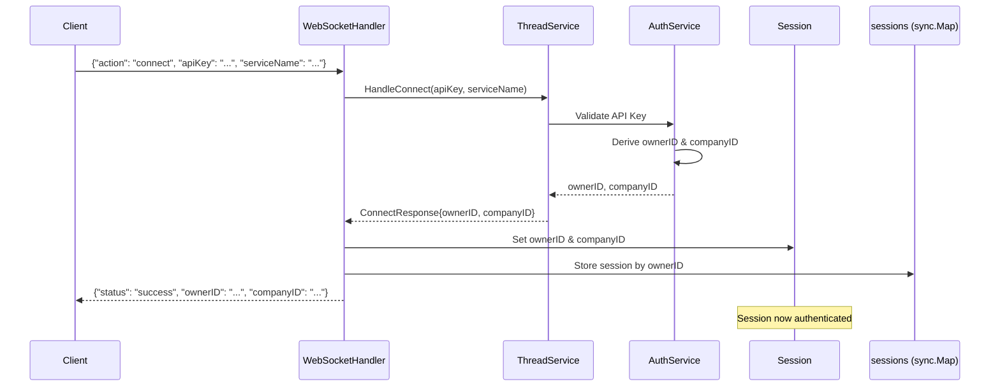

**Critical Details:**

- **Server-driven auth**: ownerID derived from API key, not client-provided
- **Multi-tenancy**: companyID extracted and stored in session
- **Session storage**: Keyed by ownerID in handler's sync.Map
- **No database call**: Auth is stateless (API key validation only)

**Response Structure:**

```json
{
  "action": "connect",
  "status": "success",
  "message": "Connected successfully",
  "ownerId": "user-123",
  "companyId": "company-456"
}
```

---

## 3. Start Thread Flow

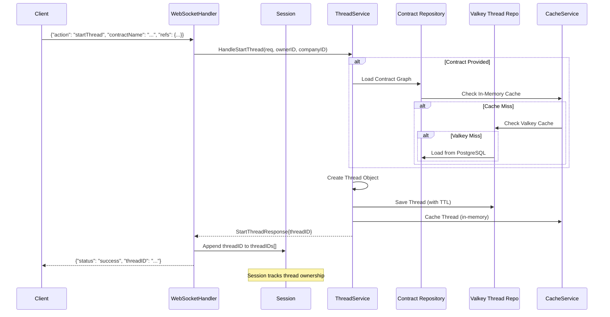

**Key Points:**

- **Three-tier caching**: In-memory → Valkey → PostgreSQL (for contracts)
- **Thread storage**: Valkey only (ephemeral with TTL)
- **Session tracking**: threadID added to session's threadIDs array
- **Multi-tenancy**: companyID embedded in thread object
- **Contract optional**: Can create threads without contracts (non-contract workflows)

**Request Structure:**

```json
{
  "action": "startThread",
  "contractName": "order-fulfillment:v2",
  "role": "buyer",
  "refs": {
    "orderId": "ORD-12345",
    "customerId": "CUST-789"
  }
}
```

**Response Structure:**

```json
{
  "action": "startThread",
  "status": "success",
  "threadId": "thread-uuid-123",
  "message": "Thread started successfully"
}
```

---

## 4. Step Event Flow (Async Processing)

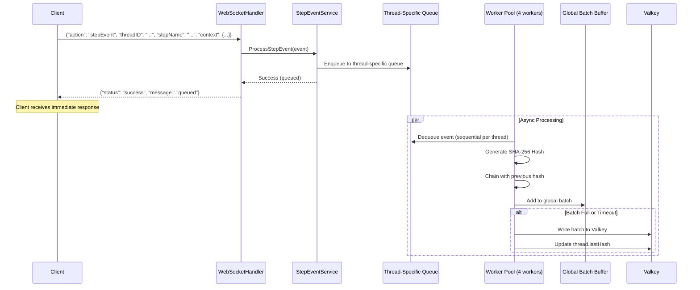

**Key Architecture:**

- **Non-blocking**: Client gets immediate response
- **Thread-specific queues**: Sequential processing per thread (maintains order)
- **Global batching**: Events from all threads batched together (performance)
- **Cryptographic chain**: Each event hashed with previous hash (integrity)
- **Worker pool**: 4 workers process events concurrently

**Request Structure:**

```json
{
  "action": "stepEvent",
  "threadId": "thread-uuid-123",
  "stepId": "step-001",
  "stepName": "validate_order",
  "serviceName": "order-service",
  "type": "step_completed",
  "status": "success",
  "context": {
    "validationResult": "passed",
    "amount": 150.00
  },
  "startedAt": "2025-12-26T00:00:00Z",
  "finishedAt": "2025-12-26T00:00:05Z"
}
```

**Response Structure:**

```json
{
  "action": "stepEvent",
  "status": "success",
  "message": "Step event queued for processing",
  "stepId": "step-001"
}
```

---

## 5. Invite Party Flow (Cross-Org Threading)

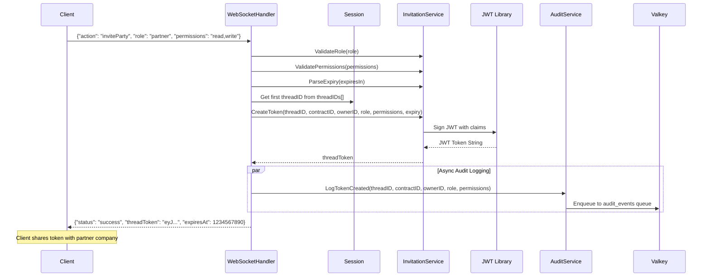

**Key Points:**

- **JWT-based**: Token contains threadID, contractID, role, permissions, expiry
- **Validation**: Role and permissions validated before token creation
- **Audit trail**: Token creation logged asynchronously (non-blocking)
- **Limitation**: Uses first thread in session (not explicitly specified)

**Request Structure:**

```json
{
  "action": "inviteParty",
  "role": "partner",
  "permissions": "read,write",
  "expiresIn": "24h"
}
```

**Response Structure:**

```json
{
  "action": "inviteParty",
  "status": "success",
  "threadToken": "eyJhbGciOiJIUzI1NiIsInR5cCI6IkpXVCJ9...",
  "role": "partner",
  "permissions": "read,write",
  "expiresAt": 1735171200,
  "message": "Invitation token created successfully"
}
```

---

## 6. Join Thread Flow (Partner Onboarding)

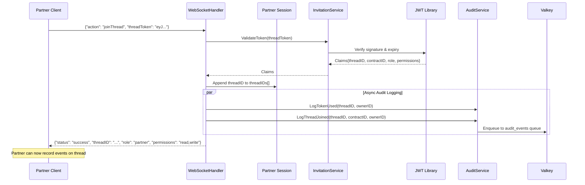

**Key Points:**

- **Token validation**: JWT signature and expiry checked
- **Session update**: Partner's session now tracks joined thread
- **Audit trail**: Token usage and thread join logged
- **No database check**: Assumes thread exists if token is valid (potential issue)

**Request Structure:**

```json
{
  "action": "joinThread",
  "threadToken": "eyJhbGciOiJIUzI1NiIsInR5cCI6IkpXVCJ9..."
}
```

**Response Structure:**

```json
{
  "action": "joinThread",
  "status": "success",
  "threadId": "thread-uuid-123",
  "contractId": "contract-456",
  "role": "partner",
  "permissions": "read,write",
  "message": "Successfully joined thread"
}
```

---

## 7. Record Event Flow (Legacy)

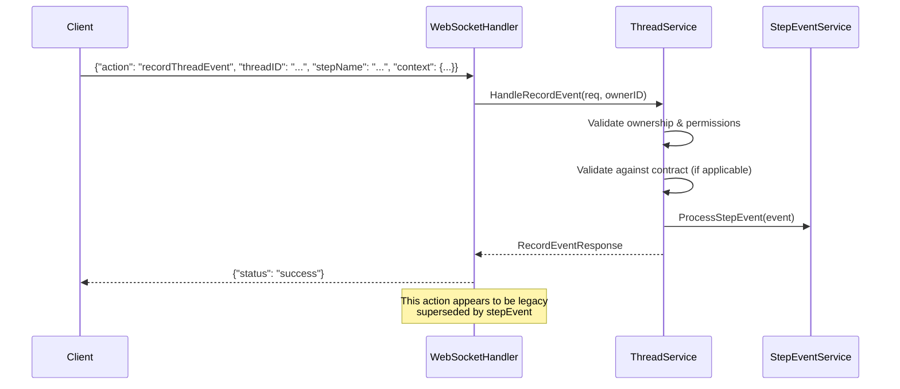

**Note**: This flow goes through ThreadService first (validation) before StepEventService, unlike the direct `stepEvent` action.

---

## 8. Close Connection Flow

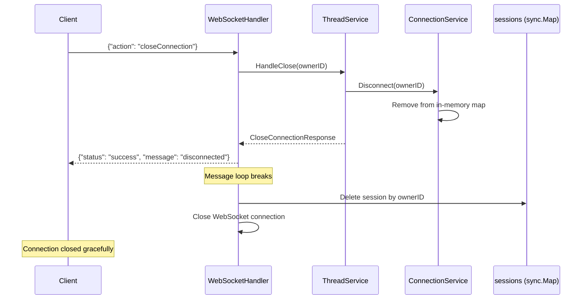

**Graceful Shutdown:**

1. Client receives confirmation response
2. Message loop breaks
3. Session cleaned from sync.Map
4. WebSocket connection closed

**Request Structure:**

```json
{
  "action": "closeConnection"
}
```

**Response Structure:**

```json
{
  "action": "closeConnection",
  "status": "success",
  "message": "Connection closed successfully"
}
```

---

## Complete Message Loop Flow

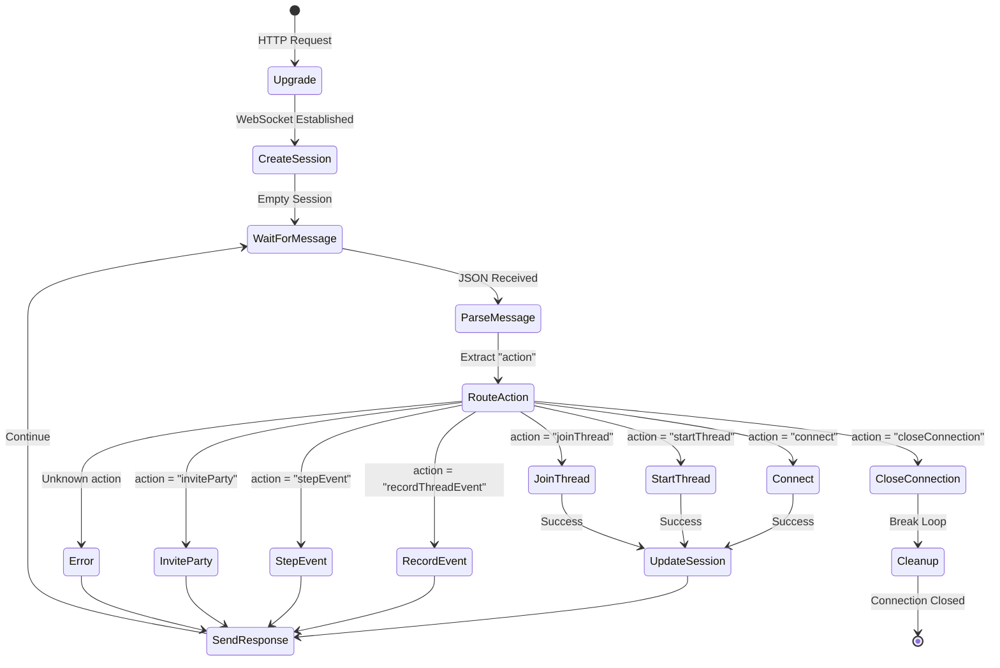

---

## Session State Transitions

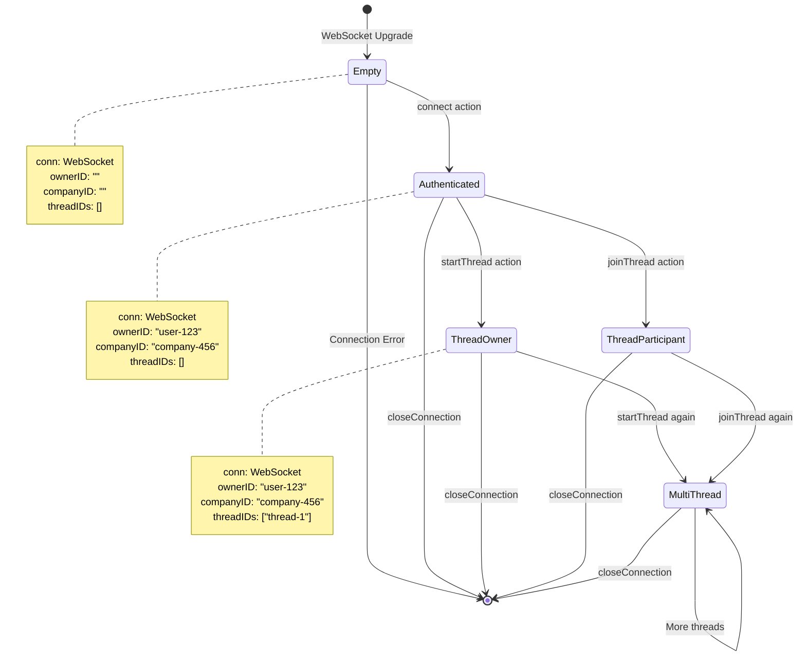

---

## Timing & Performance Characteristics

```mermaid
gantt
    title Request Processing Timeline
    dateFormat X
    axisFormat %L ms
    
    section Synchronous
    Parse Message           :0, 1
    Route Action            :1, 2
    Validate Request        :2, 5
    Business Logic          :5, 15
    Send Response           :15, 17
    
    section Async (Non-blocking)
    Queue Step Event        :17, 100
    Hash & Batch            :100, 150
    Write to Valkey         :150, 200
    Audit Logging           :17, 50
```

**Performance Notes:**

- **Synchronous**: ~15-20ms (connect, startThread, joinThread)
- **Async queuing**: ~1-2ms (stepEvent returns immediately)
- **Background processing**: 100-200ms (hashing, batching, Valkey write)
- **Audit logging**: Non-blocking (goroutine)

---

## Error Handling Flow

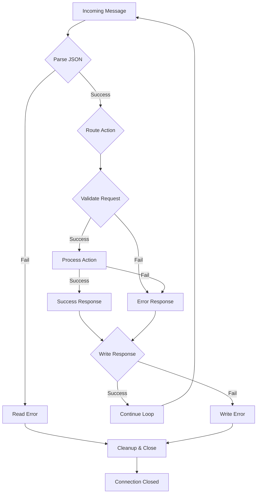

**Error Categories:**

1. **Parse errors**: Invalid JSON → break loop, close connection
2. **Validation errors**: Return error response, continue loop
3. **Processing errors**: Return error response, continue loop
4. **Write errors**: Cannot send response → break loop, close connection

**Error Response Structure:**

```json
{
  "action": "error",
  "status": "error",
  "message": "Descriptive error message"
}
```

---

## Key Architectural Patterns

### 1. Server-Driven Authentication

- Client provides API key
- Server derives ownerID and companyID
- No client-provided identity accepted
- Stateless validation (no database lookup)

### 2. Session State Management

- Handler maintains session state (not services)
- Thread-safe with sync.Mutex
- Tracks ownership (threadIDs array)
- Stored in sync.Map keyed by ownerID

### 3. Async Processing

- Step events queued immediately
- Audit logs fire-and-forget (goroutines)
- Client never waits for background work
- Worker pool processes events concurrently

### 4. Multi-Tenancy

- companyID embedded in all operations
- Session tracks company context
- Services enforce company isolation
- No cross-company data access

### 5. Cross-Organization Threading

- JWT tokens for partner access
- Role and permission validation
- Audit trail for compliance
- Token expiry enforcement

---

## Handler Structure

### WebSocketHandler

```go
type WebSocketHandler struct {
    threadService     *service.ThreadService
    stepEventService  *service.StepEventService
    invitationService *service.InvitationTokenService
    auditService      *service.AuditEventService
    sessions          sync.Map
}
```

### Session

```go
type Session struct {
    conn      *websocket.Conn
    ownerID   string
    companyID string
    threadIDs []string
    mu        sync.Mutex
}
```

**Session Lifecycle:**

1. **Created**: On WebSocket upgrade (empty)
2. **Populated**: On `connect` action (ownerID, companyID)
3. **Updated**: On `startThread` and `joinThread` (threadIDs)
4. **Cleaned**: On disconnect or `closeConnection`

---

## Action Summary Table

| Action | Auth Required | Updates Session | Async Processing | Response Time |
|--------|---------------|-----------------|------------------|---------------|
| `connect` | No | Yes (ownerID, companyID) | No | ~15ms |
| `startThread` | Yes | Yes (threadIDs) | No | ~20ms |
| `recordThreadEvent` | Yes | No | Yes (via service) | ~15ms |
| `stepEvent` | Yes | No | Yes (direct queue) | ~2ms |
| `inviteParty` | Yes | No | Yes (audit only) | ~10ms |
| `joinThread` | Yes | Yes (threadIDs) | Yes (audit only) | ~10ms |
| `closeConnection` | Yes | No | No | ~5ms |

---

## Security Considerations

### Authentication

- API key validated on connect
- ownerID derived server-side (not client-provided)
- Session tied to ownerID (cannot impersonate)

### Authorization

- Thread ownership tracked in session
- companyID enforces multi-tenancy
- JWT tokens for cross-org access

### Audit Trail

- Token creation logged
- Token usage logged
- Thread join events logged
- All audit logs stored in Valkey with retention

### Token Security

- JWT signed with secret key
- Expiry enforced (default 24h)
- Role and permissions embedded in claims
- Signature verified on validation

---

## Known Limitations & TODOs

### 1. Invite Party - Thread Selection

**Issue**: Uses first thread in session's threadIDs array  
**Location**: `internal/handlers/thread.go:245`  
**Impact**: Cannot specify which thread to invite partner to  
**Fix**: Add `threadID` to `InvitePartyRequest`

### 2. Invite Party - Contract ID

**Issue**: Hardcoded contractID as `"contract-123"`  
**Location**: `internal/handlers/thread.go:257`  
**Impact**: Token contains incorrect contract reference  
**Fix**: Retrieve contractID from thread object

### 3. Join Thread - No Thread Validation

**Issue**: No database check for thread existence  
**Location**: `internal/handlers/thread.go:316`  
**Impact**: Partner can join non-existent threads  
**Fix**: Add Valkey lookup to verify thread exists

### 4. No Permission Enforcement

**Issue**: After joining, no checks on allowed actions  
**Location**: All action handlers  
**Impact**: Partner with "read" permission can write  
**Fix**: Add permission middleware for each action

### 5. Record Event vs Step Event

**Issue**: Two similar actions with different flows  
**Location**: `recordThreadEvent` and `stepEvent`  
**Impact**: Confusion, potential inconsistency  
**Fix**: Deprecate `recordThreadEvent`, standardize on `stepEvent`

---

## Future Enhancements

### 1. Distributed Session Management

**Current**: In-memory sync.Map  
**Limitation**: Lost on server restart  
**Enhancement**: Redis-backed session store for multi-instance deployment

### 2. Thread Persistence

**Current**: Valkey only (ephemeral with TTL)  
**Limitation**: No long-term history  
**Enhancement**: Optional PostgreSQL persistence for compliance customers

### 3. Real-Time Notifications

**Current**: Request-response only  
**Enhancement**: Server-initiated messages (thread updates, partner joins)

### 4. Rate Limiting

**Current**: None at WebSocket level  
**Enhancement**: Per-connection rate limiting to prevent abuse

### 5. Compression

**Current**: Uncompressed JSON  
**Enhancement**: WebSocket compression for large payloads

---

## Conclusion

The WebSocket handler provides a robust, performant foundation for real-time workflow execution with:

- ✅ Server-driven authentication
- ✅ Multi-tenancy support
- ✅ Async event processing
- ✅ Cross-organization threading
- ✅ Audit trail for compliance

The architecture is well-suited for MVP and early growth, with clear paths for enhancement as scale requirements increase.
